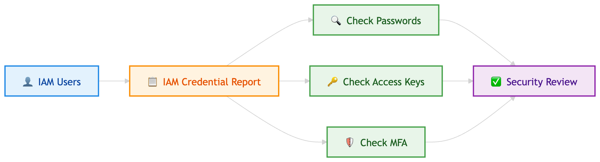

# IAM

# IAM users, groups, and policies

Think of **IAM users** as individual employees with their own badge, **groups** as teams like “Developers” or “Admins,” and **policies** as the rulebook that says what each person or team is allowed to do in AWS. A user can belong to multiple groups, and permissions are usually granted by attaching JSON-based policies to users, groups, or roles. AWS also recommends using **federated access** for human users when possible, instead of relying heavily on long-term IAM users.

**Key Use Case:**

- Choose **IAM users + groups + policies** when you need to control **who can access AWS and what actions they can perform**, especially for organized permission management across teams.

**Exam Tip:**

**If you see “manage permissions for multiple employees easily,” think “attach policies to a group, then add users to the group.”** Groups can contain users only, not other groups.

**Main Difference:**

**User = identity**, **Group = collection of users**, **Policy = permission document**.

Also, **managed policies** are reusable across multiple identities, while **inline policies** stay embedded in exactly one user, group, or role.

# IAM Roles for services

Think of an **IAM role for a service** like giving an AWS service a temporary staff badge so it can do a job for you without storing a permanent username and password. For example, **EC2** can use a role via an **instance profile**, and **Lambda** uses an **execution role** to call other AWS services securely with temporary credentials.

**Key Use Case:**

- Choose an **IAM service role** when an **AWS service needs permission to access another AWS resource on your behalf**, such as **EC2 reading from S3** or **Lambda writing logs to CloudWatch**.

**Exam Tip:**

**If you see “an AWS service needs permissions” or “avoid storing access keys on EC2,” think “IAM Role.”** For **EC2**, the keyword is often **instance profile**.

**Main Difference:**

**IAM User = long-term credentials for a person/app**, **IAM Role = temporary credentials assumed by a user, app, or AWS service**. A **service role** is assumed by a service; a **service-linked role** is a special AWS-managed type tied directly to one service.

# IAM Credential Report

An **IAM Credential Report** is like an **account-wide security checklist** that shows the status of each IAM user’s login and credentials. It helps you quickly spot risky items like **unused passwords**, **old access keys**, or users without **MFA**.

**Key Use Case:**

- Choose **IAM Credential Report** when you need to **audit IAM users’ credential hygiene** across the whole AWS account.

**Exam Tip:**

**If you see “find users without MFA,” “check old access keys,” or “audit IAM credentials account-wide,” think “Credential Report.”**

**Main Difference:**

**Credential Report** = account-level snapshot of **IAM user credential status**.

**Access Advisor / Last accessed info** = shows **which services permissions were actually used for**.

# IAM Access Advisor (Service Last Accessed data)

**IAM Access Advisor** is like a **usage tracker for permissions**—it shows which **AWS services** a user, group, role, or policy has permission to access, and **when those services were last accessed**. Architects use it to spot **unused permissions** and tighten security using **least privilege**.

**Key Use Case:**

- Choose **Access Advisor** when you want to **see which allowed AWS services were actually used** before removing excess permissions.

**Exam Tip:**

**If you see “reduce unused permissions” or “find which services a role/user actually used,” think “IAM Access Advisor / Service Last Accessed data.”**

**Main Difference:**

**Access Advisor** = shows **service usage history** for a **user, group, role, or policy**.

**Credential Report** = shows **credential status** for **IAM users** only, such as **passwords, access keys, and MFA**.

