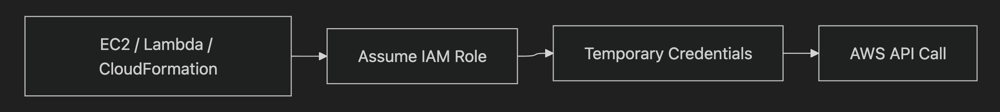
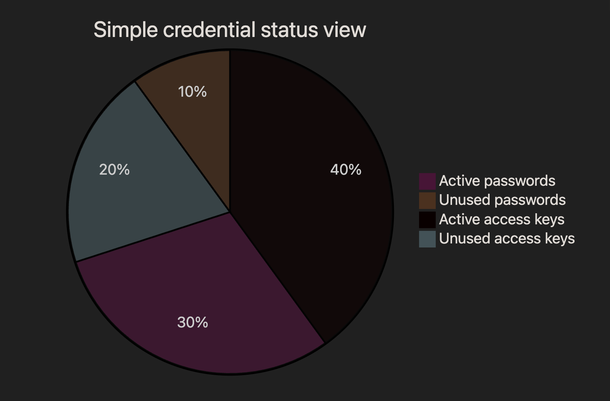
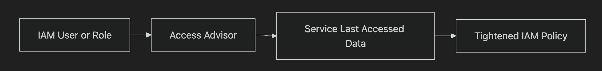

# IAM

## IAM users, groups, and policies

- **IAM user**
    - A user is an identity for one person or app that needs to sign in or make AWS API calls.
    - Create IAM users mainly when a **human** or external system needs direct AWS access.
- **Why it matters**
    - In AWS, avoid using the root account for daily work; use IAM users instead.
    - For the exam, users usually represent people, not AWS services.
- **IAM group**
    - A group is a collection of IAM users.
    - You put users in groups so multiple users can share the same permissions.
- **Why it matters**
    - Groups make permission management easier, like giving all admins or developers the same access.
    - Best practice: assign permissions to groups instead of attaching policies to each user one by one.
- **IAM policy**
    - A policy is a JSON permission document that says what actions are allowed or denied on which AWS resources.
    - Policies can be attached to users, groups, or roles.
- **Why it matters**
    - Policies are the main way AWS controls access.
    - Exam point: permissions often flow through **user → group → policy**, though policies can also attach directly to a user.

## IAM Roles for services

- **IAM role**
    - A role is an AWS identity with permissions, but it is **not tied to one fixed person or login**.
    - Unlike a user, a role does not usually have long-term credentials like a permanent password or access key.
- **How services use roles**
    - AWS services such as EC2, Lambda, and CloudFormation can **assume** a role to get temporary credentials.
    - The service then uses those temporary credentials to call other AWS APIs.
- **Why it matters**
    - This is best practice because temporary credentials are safer than storing long-term access keys.
    - Exam point: for AWS services, choose an IAM role instead of embedding credentials in code.

## IAM Credential Report

- **What it is**
    - The IAM Credential Report is an account-level report listing the credential status of all IAM users.
    - You can generate it, and AWS provides the latest report; a new one can be generated about every **4 hours**.
- **What it includes**
    - It shows details such as password enabled, access keys, key age, MFA enabled, and last used times.
    - It helps you spot old passwords, unused keys, or users without MFA.
- **Why it matters**
    - It is useful for security reviews, compliance checks, and cleaning up stale access.
    - Exam point: use Credential Report when the question asks for an account-wide audit of IAM user credentials.
    
    
    

## IAM Access Advisor (Service Last Accessed data)

- **What it shows**
    - IAM Access Advisor shows which AWS services a user, group, or role has permission to access and when each service was last accessed.
    - It focuses on **service last accessed**, not every individual API action.
- **Why it matters**
    - It helps identify permissions that are not being used, so you can remove them and enforce least privilege.
    - Exam point: if the goal is to tighten overly broad permissions, Access Advisor is often the right clue.

## Exam tips

- If the question is about **people needing AWS access**, think **IAM users** and often **groups**.
- If the question is about **AWS services calling AWS APIs**, think **IAM roles**.
- If the question asks for an **account-wide credential audit**, think **IAM Credential Report**.
- If the question asks how to find **unused permissions**, think **Access Advisor**.
- If the question mentions **temporary credentials** and **best practice**, the answer is usually **IAM role**.