# EC2

## EC2 basics

- **Definition:** Amazon EC2 (Elastic Compute Cloud) is AWS’s service for renting virtual servers in the cloud. An **EC2 instance** is one of those virtual servers that runs your OS, apps, and workloads.
- **Why it matters:** EC2 is a core compute service in AWS and shows up often in the SAA exam. Know that you choose an AMI to launch it, and that billing depends on the instance state and pricing model.
- **Key notes:**
    - **AMI (Amazon Machine Image):** a template with OS and setup info used to launch an instance.
    - **Launch:** create and start the instance.
    - **Stop:** shut down the instance but keep it for later; usually compute billing stops.
    - **Terminate:** permanently delete the instance.
    - Root storage like **EBS** may still cost money even when the instance is stopped.

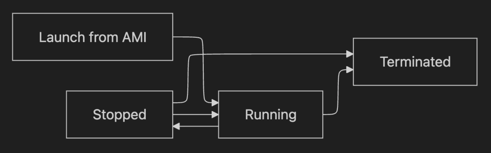

## EC2 sizing & configuration options

- **Definition:** EC2 sizing means choosing how much CPU, memory, storage, and network capacity your instance needs. Configuration also includes the software image and network settings used at launch.
- **Why it matters:** Picking the right size avoids poor performance or wasted cost. On the exam, look for clues like “memory-heavy,” “burstable,” or “needs high IOPS” to choose correctly.
- **Key notes:**
    - **vCPU:** virtual CPU power.
    - **Memory (RAM):** needed for apps, caching, and large datasets.
    - **Storage:** root volume and extra disks, often EBS.
    - **Network:** bandwidth/performance available to the instance.
    - Common launch choices:
        - **Instance type:** hardware size/family.
        - **AMI:** OS/app template.
        - **Key pair:** used for secure login.
        - **VPC/Subnet:** network placement.
        - **Root volume:** main boot disk.

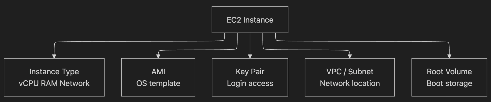

## EC2 Instance Types

- **Definition:** EC2 instance types are grouped into families based on what they are optimized for, such as balanced use, CPU power, memory size, or storage speed.
- **Why it matters:** The exam often tests matching the workload to the correct family. Choose based on the bottleneck: CPU, memory, storage, or balanced needs.
- **Key notes:**
    - **General purpose:** balanced CPU/memory/network; good for web apps and small databases.
    - **Compute optimized:** more CPU; good for batch processing, game servers, and compute-heavy apps.
    - **Memory optimized:** more RAM; good for in-memory databases, caching, analytics.
    - **Storage optimized:** fast/high local storage access; good for large transactional or log workloads.

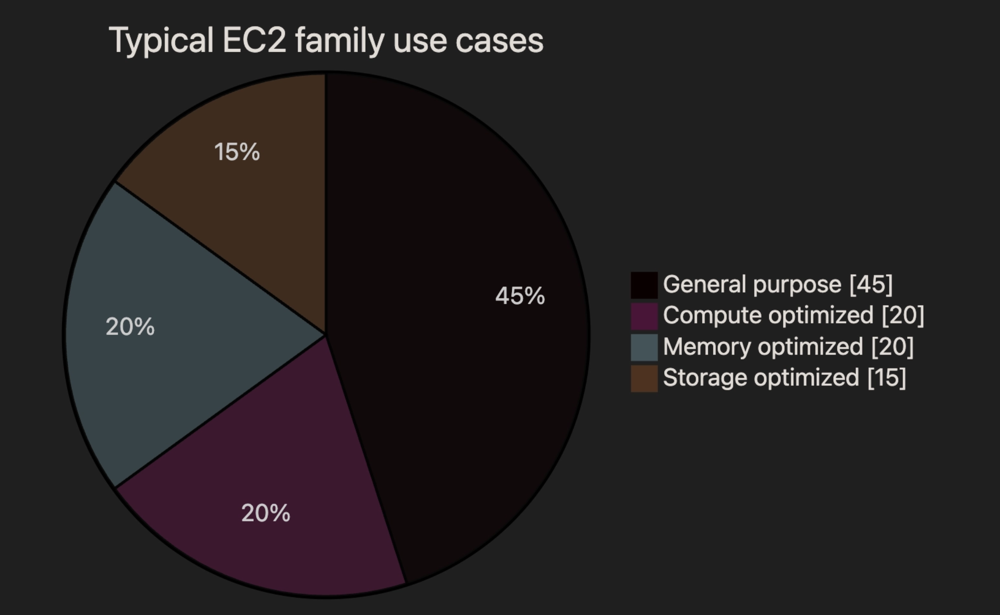

### Security Groups

- **Definition:** A security group is a virtual firewall attached to an EC2 instance that controls allowed inbound and outbound traffic. It works at the instance level.
- **Why it matters:** Security groups are heavily tested in SAA. Remember: they only contain **allow** rules, they are **stateful**, and anything not allowed is denied by default.
- **Key notes:**
    - Rules are based on **protocol**, **port**, and **source/destination**.
    - **Stateful** means return traffic is automatically allowed if the original traffic was allowed.
    - Default behavior:
        - Inbound: denied unless allowed.
        - Outbound: usually allowed by default, unless changed.

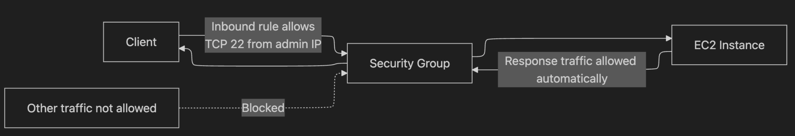

### EC2 SSH connection

- **Definition:** SSH is the secure way to connect from your computer to a Linux EC2 instance. You usually need a key pair, the instance’s public IP or public DNS, and port 22 open.
- **Why it matters:** SSH questions often test what blocks connectivity. The answer is usually one of these: wrong key pair, no public route, port 22 blocked in the security group, or subnet/route issues.
- **Key notes:**
    - **Key pair:** AWS stores the public key; you keep the private key.
    - Password login is usually avoided because key pairs are more secure.
    - Common blockers:
        - Security group does not allow TCP 22.
        - Instance has no public IP / no internet route.
        - Wrong username or wrong private key.
        - Network ACL or route table issue.

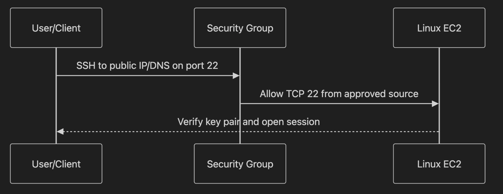

## IAM roles for EC2

- **Definition:** An IAM role for EC2 gives the instance temporary AWS permissions without storing access keys on the server. Apps on the instance use the role to call AWS services securely.
- **Why it matters:** This is a favorite exam topic. Best practice is to use an **IAM role** attached through an **instance profile**, not hard-coded access keys in code or config files.
- **Key notes:**
    - **IAM role:** set of permissions AWS can grant temporarily.
    - **Instance profile:** the container that attaches the role to the EC2 instance.
    - Example use cases:
        - EC2 reads from S3
        - EC2 writes logs to CloudWatch
        - EC2 reads secrets from AWS services

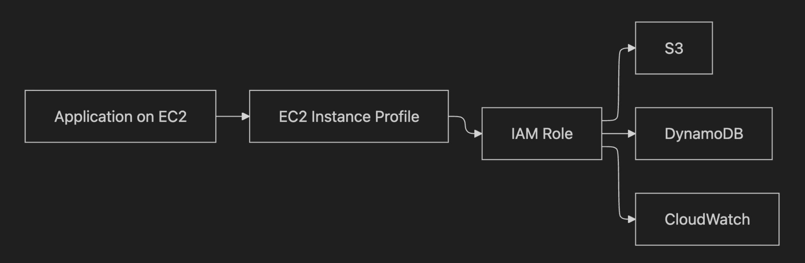

## EC2 purchase options

- **Definition:** EC2 purchase options are different pricing models for running instances. The main ones for SAA are On-Demand, Reserved Instances, and Spot Instances.
- **Why it matters:** The exam tests cost optimization a lot. Choose based on workload predictability and whether interruption is acceptable.
- **Key notes:**
    - **On-Demand:** pay as you go; best for short-term, unpredictable workloads.
    - **Reserved Instances:** commit for longer use; best for steady, predictable workloads; lower cost than On-Demand.
    - **Spot Instances:** cheapest, but AWS can reclaim them; best for fault-tolerant batch jobs, analytics, and flexible workloads.

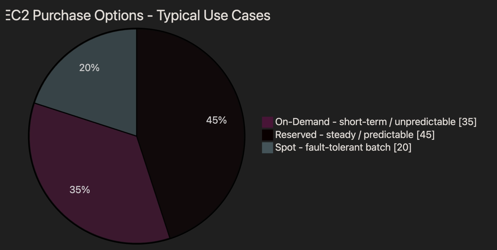

- **How to read the chart for exam prep:**
    - Higher score here roughly means better overall reliability/predictability.
    - Spot is cheapest, but least reliable for uninterrupted runtime.
    - Reserved is best when usage is steady and long-term.

## Exam tips

- If the question says **steady usage for months or years**, think **Reserved Instances**; if it says **can handle interruption**, think **Spot**.
- If the workload says **high CPU**, choose **compute optimized**; if it says **large in-memory DB/cache**, choose **memory optimized**.
- If SSH fails, first check **security group port 22**, **public IP/public route**, and **correct key pair**.
- If an app on EC2 needs AWS access, choose an **IAM role attached to the instance**, not hard-coded credentials.

## EC2 (SAA level)

## 1) Elastic IP

- **Definition:** An Elastic IP is a fixed public IPv4 address you can keep and remap to an EC2 instance. It helps when a normal public IP would change after stop/start.
- **Why it matters:** Good for cases where you need a stable public IP. For the exam, remember AWS usually prefers using a DNS name over relying on Elastic IPs everywhere, because too many Elastic IPs is often a sign of weak design.
    
    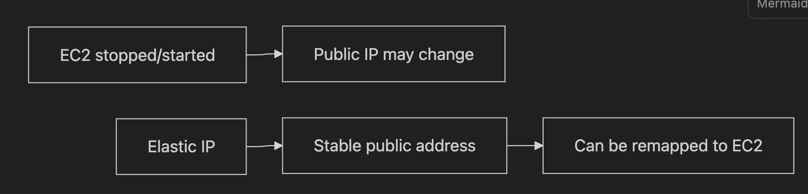
    

## 2) Placement Groups

- **Definition:** Placement Groups control how EC2 instances are physically placed on AWS infrastructure. This affects performance, availability, and fault isolation.
- **Why it matters:** Exam questions often ask which strategy fits a workload: fastest networking, highest isolation, or large distributed clusters. The key is matching the business need to the right placement type.
    
    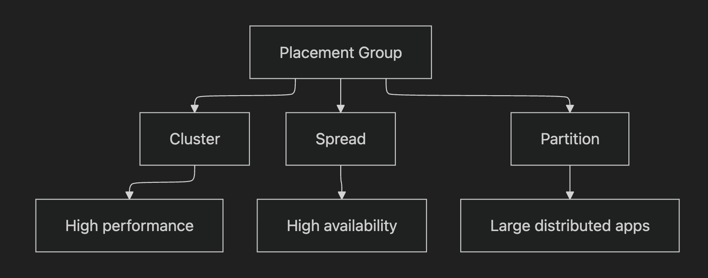
    

### 2a) Cluster Placement Group

- **Definition:** Cluster places instances close together inside a single Availability Zone. This gives very low latency and high network performance.
- **Why it matters:** Best for workloads needing very fast communication between instances, such as big data or HPC-style jobs. Risk: if that AZ fails, all those instances can fail together.
    
    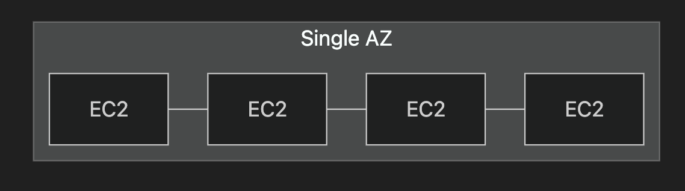
    

### 2b) Spread Placement Group

- **Definition:** Spread puts each instance on separate underlying hardware. This reduces the chance that one hardware failure affects multiple instances.
- **Why it matters:** Best when availability is more important than raw speed. For the exam, remember it supports only a small number of instances per AZ, but gives strong isolation.

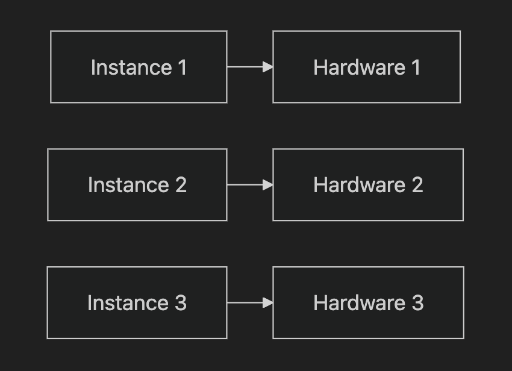

### 2c) Partition Placement Group

- **Definition:** Partition spreads instances across separate partitions, where each partition uses different racks. This is designed for large distributed systems.
- **Why it matters:** Good for apps like Hadoop, Cassandra, HBase, or Kafka, where you want failure isolated to one partition instead of the whole fleet. On the exam, think “big clustered app with rack awareness.”
    
    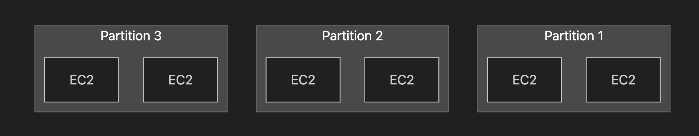
    

## 3) Elastic Network Interface (ENI)

- **Definition:** An ENI is a virtual network card in a VPC. It can have private IPs, a public IP, an Elastic IP, security groups, and a MAC address.
- **Why it matters:** ENIs are useful when you need to move networking settings from one EC2 instance to another during failover. For the exam, remember an ENI is tied to a specific AZ, even if it can be detached and reattached between instances in that AZ.
    
    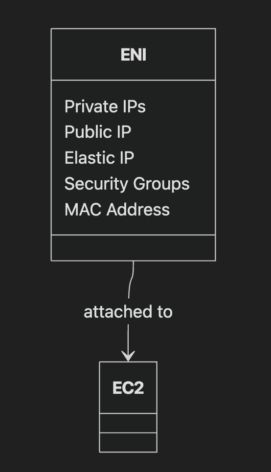
    

## 4) EC2 Hibernate

- **Definition:** EC2 Hibernate stops the instance but saves the contents of RAM to the root EBS volume, so the instance can start again faster with its memory state restored.
- **Why it matters:** Useful for long startup apps, long-running processes, or when you want to resume exactly where you left off. In exam questions, watch for clues like “preserve RAM state,” “faster restart than stop/start,” and “encrypted EBS/root volume required.”
    
    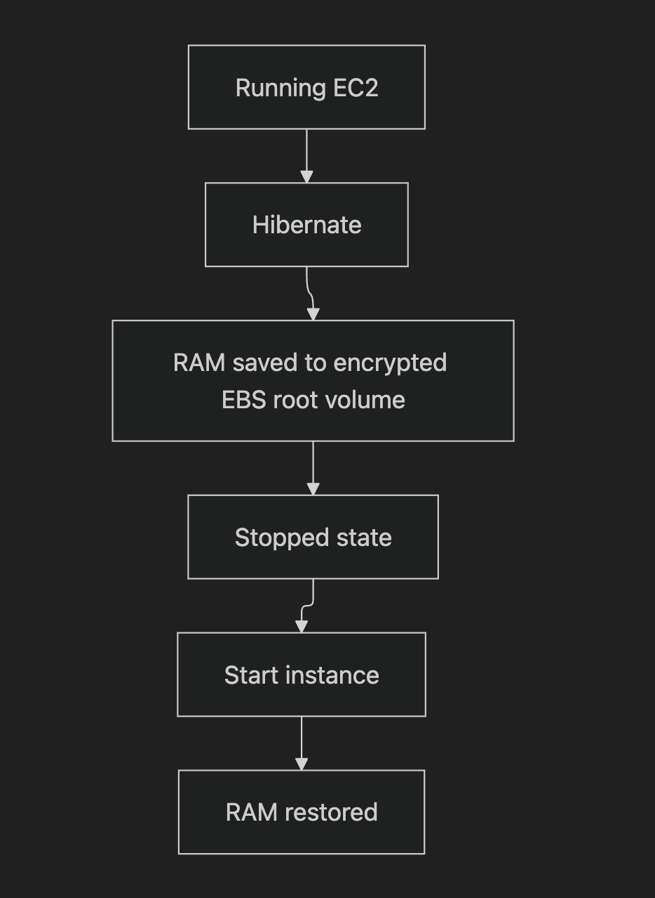
    

## Practical sections shown in the PDF

- **Placement Groups practical:** Create cluster, spread, and partition placement groups, then choose one during EC2 launch in advanced details.
- **ENI practical:** Create a network interface, choose the correct subnet/AZ, and attach it to an EC2 instance.
- **Hibernate practical:** Enable Hibernate when launching the instance, make sure storage is sufficient, and use an encrypted volume.
    
    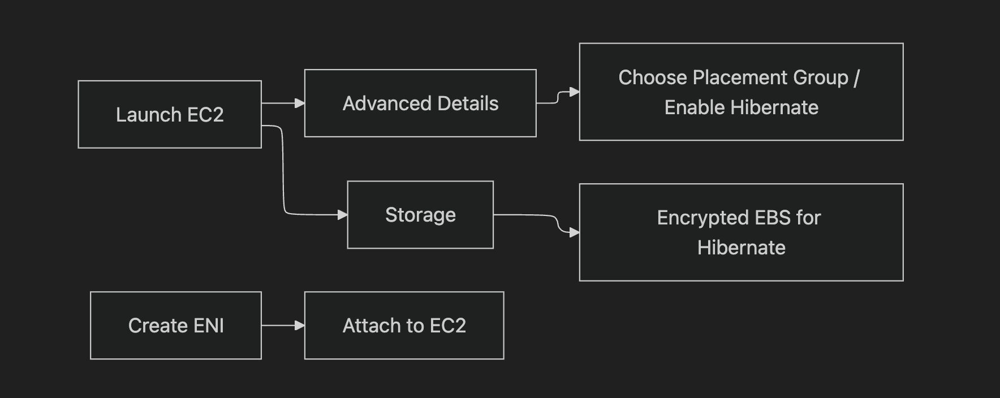
    

## Exam-style tips

- If the question says **highest network performance in one AZ**, think **Cluster Placement Group**.
- If it says **instances must not fail together**, think **Spread Placement Group**.
- If it describes **large distributed systems like Kafka or Cassandra**, think **Partition Placement Group**.
- If it says **move network identity/security settings between EC2 instances**, think **ENI**.
- If it says **resume with RAM preserved after stop**, think **EC2 Hibernate**.

## EC2 Storage

## 1) Elastic Block Store (EBS)

- **Definition:** EBS is a network-based block storage volume that you attach to an EC2 instance. The notes say it is usually attached to one instance at a time and is tied to a single Availability Zone (AZ).
- **Why it matters:** In the exam, think of EBS when one server needs durable disk storage, especially for boot volumes. A key clue is **persistent storage for EC2** that stays after stop/start, and AZ scope matters for design.

## 2) EBS Snapshots

- **Definition:** An EBS snapshot is a point-in-time backup of an EBS volume. The notes also mention snapshots can be copied across AZs or Regions.
- **Why it matters:** This is the exam answer for **backup, restore, and migration of EBS data**, especially when moving storage to another AZ or Region. The page 2–3 diagrams show snapshot → restore as the normal path.

## 3) EBS Snapshot Features

- **Definition:** The notes list **Snapshot Archive**, **Recycle Bin**, and **Fast Snapshot Restore (FSR)**. Archive lowers cost, Recycle Bin helps recover deleted snapshots, and FSR removes first-read delay.
- **Why it matters:** Use these for exam questions about **cost savings**, **accidental deletion recovery**, or **fast restore performance**. A big clue is “cheaper long-term backup” or “instant performance after restore.”

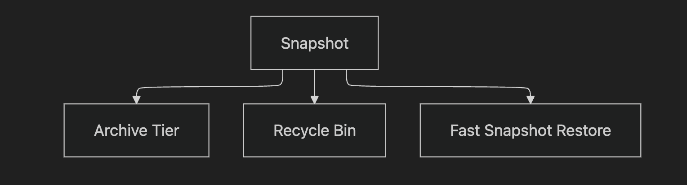

## 4) Amazon Machine Image (AMI)

- **Definition:** AMI stands for **Amazon Machine Image**. It is a prebuilt template for launching EC2 instances with OS, software, and configuration already included.
- **Why it matters:** AMIs are important when the exam asks for **fast repeatable server deployment**. The page 5 diagram shows a common flow: create AMI from an instance, then launch more instances from it.

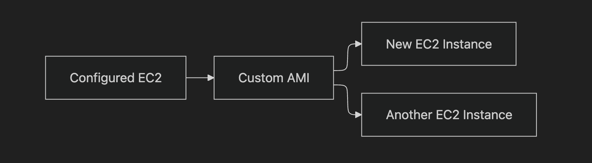

## 5) EBS Volume Types

- **Definition:** The notes list **gp2/gp3** for general-purpose SSD, **io1/io2** for highest-performance SSD, and **st1/sc1** for HDD use cases. They also note only **gp2/gp3 and io1/io2** can be boot volumes.
- **Why it matters:** This is a favorite exam match-the-storage question. Choose **gp3** for balanced cost/performance, **io1/io2** for mission-critical low-latency workloads, and HDD types for cheaper large-volume throughput use cases.

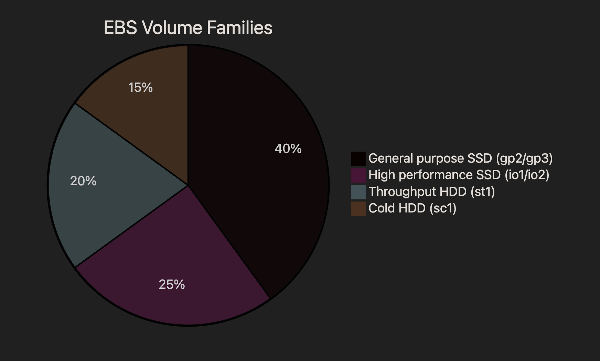

## 6) EBS Multi-Attach

- **Definition:** EBS Multi-Attach lets the same **io1/io2** volume connect to multiple EC2 instances in the **same AZ**. The notes say up to 16 instances can connect at once.
- **Why it matters:** On the exam, this is the exception to the normal “one EBS volume to one instance” rule. Watch for wording like **shared high-performance block storage in one AZ**.

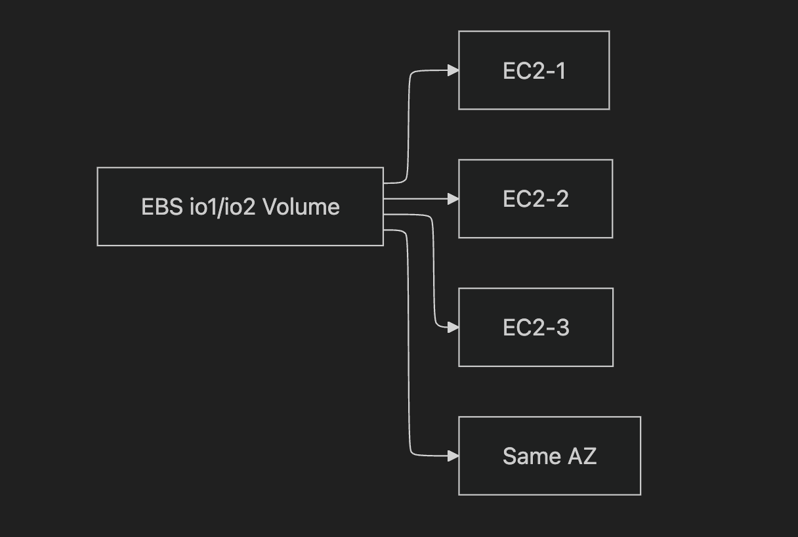

## 7) Elastic File System (EFS)

- **Definition:** EFS is a managed **network file system (NFS)** that many EC2 instances can mount at the same time. The notes say it works across multiple AZs and is Linux-focused.
- **Why it matters:** In the exam, choose EFS when many EC2 instances need to **share the same files**. The page 7 and page 12 diagrams show multiple instances mounting one shared file system.

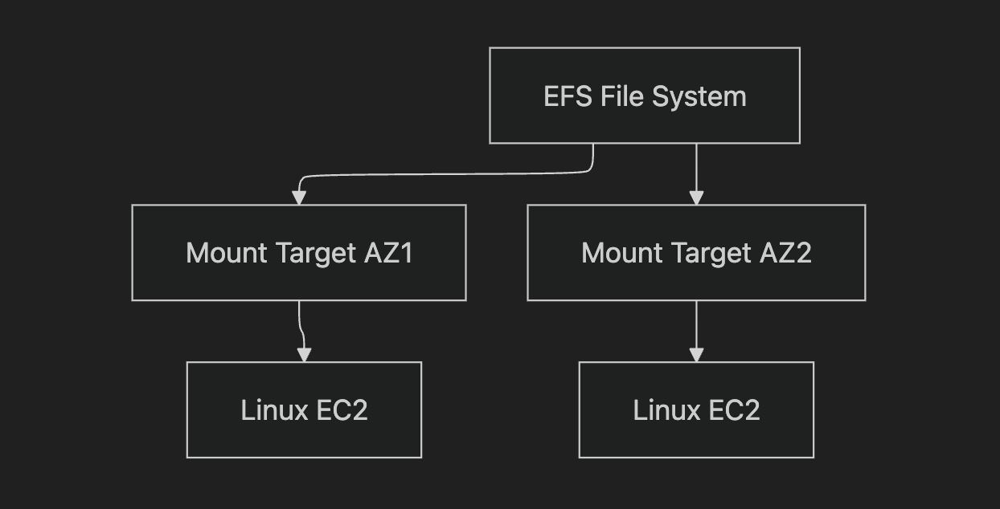

## 8) EFS Access and Use Cases

- **Definition:** The notes say EFS uses **NFSv4.1**, uses **security groups** for access control, supports encryption at rest, and common use cases are content management, web serving, and data sharing.
- **Why it matters:** This helps with scenario questions where a shared website directory or CMS content must be available to many instances. If the question says **shared files across EC2**, EFS is a strong signal.

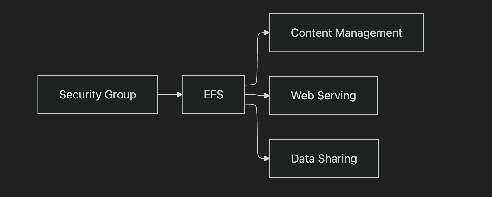

## 9) EFS Performance and Throughput Modes

- **Definition:** The notes list **General Purpose** mode for latency-sensitive workloads and **Max I/O** for highly parallel workloads. They also list **Bursting**, **Provisioned**, and **Elastic** throughput modes.
- **Why it matters:** In exam questions, use **General Purpose** for normal web apps and **Max I/O** for heavy parallel processing. For unpredictable workloads, the notes point to **Elastic throughput**.

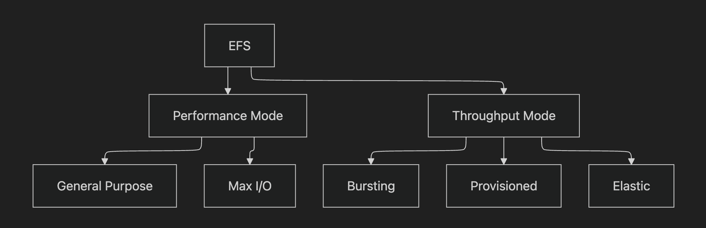

## 10) EFS Storage Classes and Lifecycle Tiers

- **Definition:** The notes list **Standard**, **EFS Infrequent Access (EFS-IA)**, and **Archive**. Lifecycle rules can move files after a number of days to reduce storage cost.
- **Why it matters:** This is useful for exam questions about **shared file storage with automatic cost optimization**. The page 9 visual shows files moving from EFS Standard to EFS IA after no access for a period.

## 11) EBS vs EFS vs Instance Store

- **Definition:** The notes compare EBS and EFS directly and end with “Remember: EFS vs EBS vs Instance Store.” EBS is single-instance style block storage in one AZ, while EFS is shared file storage across many Linux instances and AZs.
- **Why it matters:** This comparison is very exam-heavy. Use **EBS** for one instance needing a disk, **EFS** for shared files across many instances, and **Instance Store** when the question points to very temporary local storage on the host.

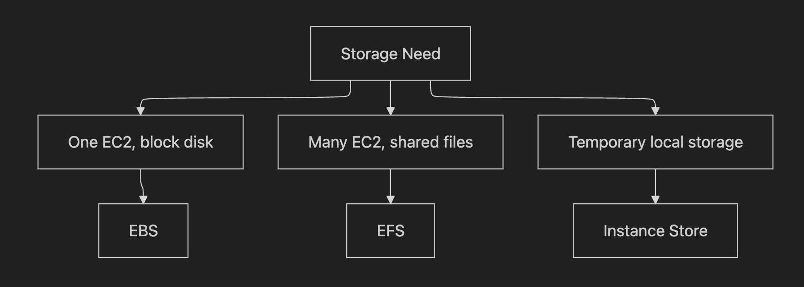

## 12) Small but important exam notes from the PDF

- **EBS is tied to one AZ**; to move it, snapshot it and restore it in another AZ.
- **gp2 IOPS grow with size**, but **gp3 and io1** can increase performance more independently.
- **EFS is more expensive than EBS**, but it gives shared multi-AZ file access.
- The diagrams on **pages 2, 5, 7, 9, 11, and 12** are all showing the same exam theme: choose storage based on **single instance vs shared access vs restore/migration path**.

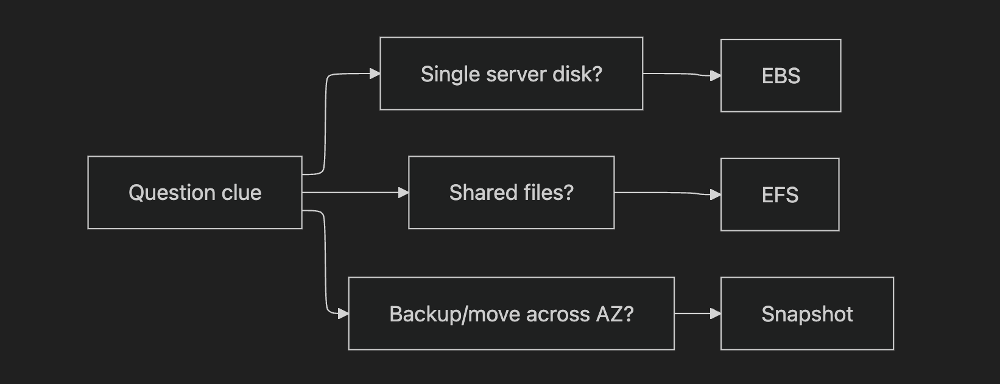

## Exam-style tips

- If the question says **one EC2 instance needs persistent storage**, think **EBS**.
- If it says **many EC2 instances need to read/write the same files**, think **EFS**.
- If it says **move an EBS volume to another AZ or Region**, think **snapshot and restore/copy**.
- If it says **preconfigured server template for quick launches**, think **AMI**.
- If it says **temporary local high-speed storage**, think **Instance Store**, not EBS or EFS.