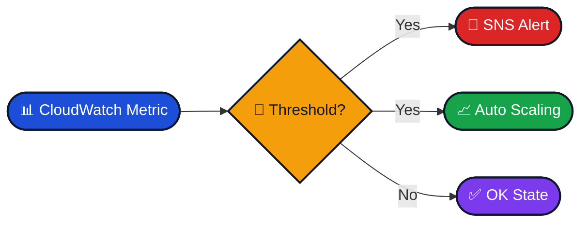

# CloudWatch Alarm

## Simple Explanation
CloudWatch Alarm watches a CloudWatch metric and checks whether it crosses a limit you set.  
When that happens, it changes state and can trigger an action like sending a notification or scaling resources.

## Key Use Case
- Alert when CPU, memory, or errors go too high 🚨
- Trigger Auto Scaling when workload increases 📈

## Practical Scenario
Your EC2 web server gets busy during office hours.  
You create a CloudWatch Alarm for high CPU usage.  
If CPU stays above 80%, the alarm sends an SNS notification or scales out more instances.

## Exam Tip
- Think: metric threshold + action.
- Alarm watches metrics, not application logs directly.

## Difference Comparison

| Service | Best For | Key Difference |
|---------|----------|----------------|
| CloudWatch Alarm | Threshold alerts | Reacts to metric state changes |
| EventBridge | Event routing | Reacts to events, not metric thresholds |

## Muscle Memory One-Liner
**CloudWatch Alarm = “If metric crosses the line, do something.”**

## Visual Diagram

## Final Summary Table

| Topic | What It Is | Best Use Case | Common Confusion | Memory Hook |
|------|-------------|---------------|------------------|-------------|
| CloudWatch Alarm | Metric-based alert tool | Alert or act on thresholds | EventBridge | If metric crosses the line, act |
